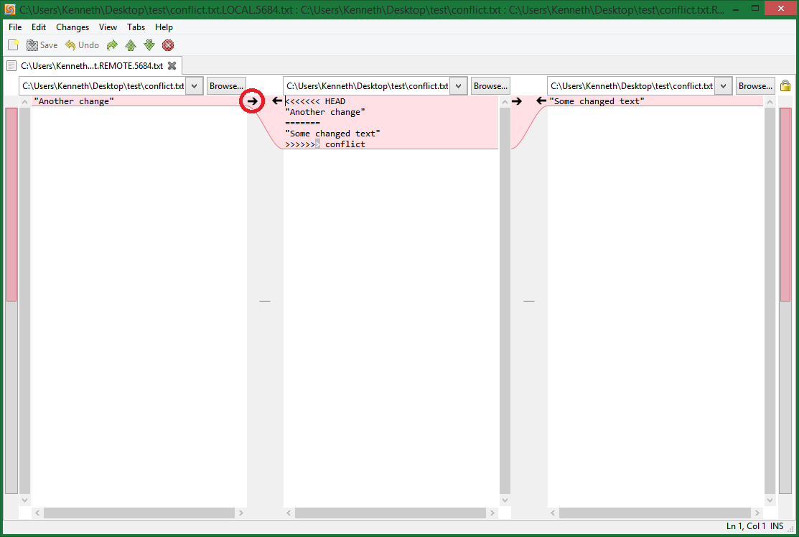
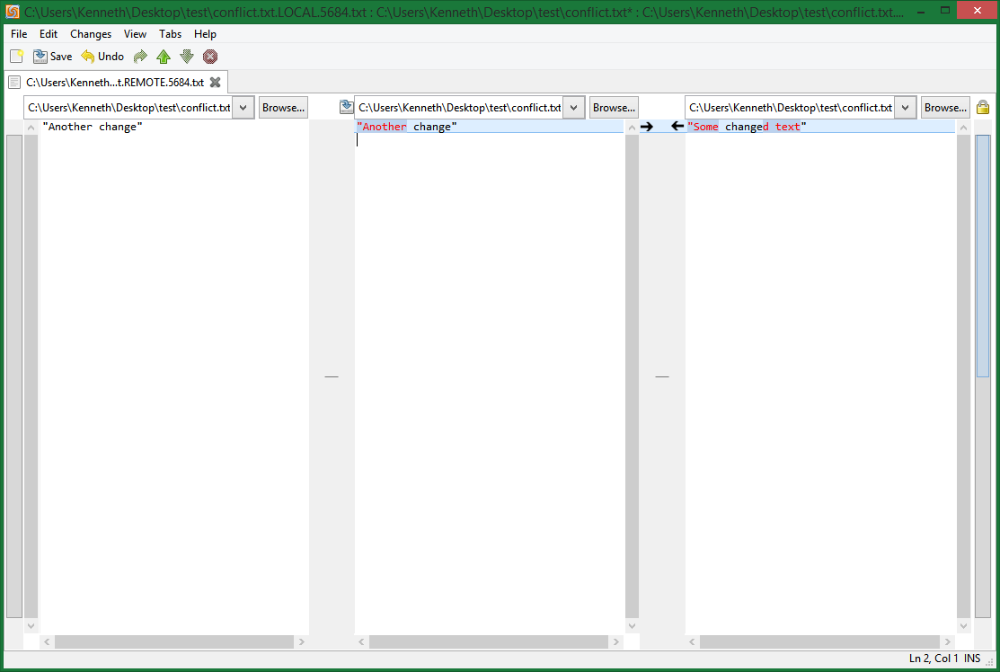
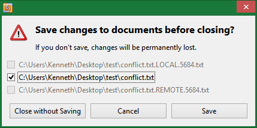

# Git Workshop

## Configuration

This workshop has been written with a focus on using Git Bash on Windows or bash shell, alternative setups will likely work without issue.

### User Settings

Before being able to commit files to any of the git repositories locally git requires two pieces of information, your name and email address. This is used to identify you as the person who commited the code. These settings can be set on a per repository basis or globally (for all repositories) using the following commands.

```
git config --global user.name "Your Name"
git config --global user.email "your.name@email.server"
```

### SSH Settings

When working with remote repositories there are two methods of connecting to the remote git server, using HTTPS and using SSH. When pushing to a git server when connecting with HTTPS you will be asked for your username and password for the server, this can be tedious to repeatedly enter when simply uploading your changes, by using SSH keys you no longer need to enter your credentials. This approach uses OpenSSH, it is also possible to use alternatives but this is not covered here.

#### 1: Check for an existing SSH key

```
cd ~/.ssh
ls -a
```

If you see the file `id_rsa.pub` then you already have an SSH key and can skip to Section 3.

#### 2: Create a new SSH key

We will be using the `ssh-keygen` tool to create a new SSH key with the RSA cryptosystem, your email is also required in this step.

```
ssh-keygen -t rsa -C "your.name@email.server"
```

The first prompt will ask where the SSH key should be stored, the default location is preferable so that Git will be able to find the key without issue, simply press enter.

The you will be prompted to enter a passphrase (and confirmation) required to use the SSH key, if you are working on a trusted system just press enter twice so that no passphrase is required.

You should now have two new files in your `~/.ssh` directory: your private key `id_rsa` which must be kept safe, and public key `id_rsa.pub` which can be provided to a Git server to enable SSH authentication.

#### 3: Adding SSH key to you Git server

This step depends on who your chosen Git hosting provider is, for sites such as [GitHub](https://github.com) and [Bitbucket](httsp://bitbucket.org) and self hosted installations of [GitLab](https://gitlab.com) has a settings section which allows you to add your public key to the server quickly and easily.

### Mergetool

Solving merge conflicts can be a difficult and tedious task which can be made much easier with a visual merge tool such as [meld](http://meldmerge.org/). `meld` is available for [Windows](http://sourceforge.net/projects/meld-installer/) as well as Unix based systems. Other merge tools are available and are usually a personal preference.

In order to setup Git to take advantage of an installed merge tool on Windows we need to perform the following configuration. Take care to replace the path to your merge tool with the correct path to the exectuable.

```
git config --global mergetool.meld.path "C:\Program Files (x86)\Meld\bin\meld\meld.exe"
git config --global merge.tool meld
```

### Help

#### Autocorrect

It is a common problem to type a Git command incorrectly and recieve a message such as the following.

```
git: 'stauts' is not a git command. See 'git --help'.

Did you mean this?
        status
```

If this is a common problem for you then it is possible to enable a helper setting which will make an attempt to guess which command you were attempting to use.

```
git config --global help.autocorrect 1
```

### Cross Platform Issues

#### Line Endings (Optional)

When working on cross platforms projects, or using the same hard drive in combination with different operating systems, problems arise with the way text is stored on disk. Specifically Windows and Unix like systems use different characters to define the end of a line, Windows uses CRLF and Unix like systems use LR.

The following setting tells Git to automatically deal with line endings globally.

```
git config --global core.autocrlf true
```

If you checkout a commit before setting this option, you may be asked to commit changes to files you have not changed. In this situation the easist apporach is to remove the files which were checked out with the wrong line endings then perform a hard reset on the repository, this will checkout the files with the correct line endings. Be careful not to loss any changes you have made.

### Useful Aliases (Optional)

When working on projects with many branches it can be confusing to determine the order of commits and which branches were merges and where. With the following alias it is possible show this information on the command line.

First we need to create an alias called `tree` (you can choose your own alias name) which will be the shorthand for the command. Note that this is a long command which is why having an alias is preferable.

```
git config --global alias.tree "log --graph --abbrev-commit --decorate --date=relative --format=format:'%C(bold blue)%h%C(reset) - %C(bold green)(%ar)%C(reset) %C(white)%s%C(reset) %C(dim white)- %an%C(reset)%C(bold yellow)%d%C(reset)' --all"
```

Once this is done we can use the alias with the command `git tree`.

## Tutorials

### Stashing

The stash is a temporary place where local changes can stored whilst other operations are performed on the repository, such as pulling the lastest commits or changing branch before a commit. To stash changes is simple.

```
git stash
```

You should see the following if the stash was successful.

```
Saved working directory and index state WIP on master: <commit> <message>
```

Otherwise if you have not made any changes you will see the following, please make a change to a file in order to continue.

```
No local changes to save
```

Now that we have stashed some changes we can do whichever task for which the stash was required. It is possible to list all the current stashes.

```
git stash list
```

Which will show output in the following form.

```
stash@{0}: WIP on master: <commit> <message>
... possibly more stashes ...
```

Stashes are stored in a stack, so the latest stash will have the `stash@{0}` identifier, any older stashes will have the form `stash@{n}` where `n` is the position in the stack.

When the time comes when you want to unstash the changes there are two options, apply the changes or pop the changes which does an apply then a drop. We will start with apply.

```
git stash apply stash@{0}
```

A successful apply will show the output of a call to `git status` and your changes will be applied to the repository. If we call `git stash list` you will see that your stash is still avaialble.

The alternative is to use `git stash pop` which will apply the changes then drop the stash from the stash list. First we need to perform a hard reset to avoid a merge conflict.

```
git reset --hard HEAD
git stash pop
git stash list
```

If all goes well the stash should be applied to the working directory and the displayed list will no longer show the stash. Lets add the stash once again, then explore how to view the contents of a stash.

```
git stash
git stash list
```

To view the contents of a stash we can use `git stash show stash@{0}` to see the insertions and deletions, however it is usually more useful to see the changes in patch form.

```
git stash show -p stash@{0}
```

Finally if we decide we no longer require the changes containted within it. The stash can be dropped as follows.

```
git stash drop stash@{0}
git stash list
```

### Merging

The majoritory of the time `git` can automatically merge files without problems, this gives learning how to deal with merge conflicts a lower priority especially when working on your own. However when a merge conflict does arise it can be a slow and painful experience to fix it properly. This section relies on having a visual merge tool setup on your system, we will be using `meld` which you should have setup if you followed the Mergetool section above.

First of all lets setup a situation where a merge conflict will occur, for this we need to have a file commited in out repository.

```
echo "Some text" > conflict.txt
git add conflict.txt
git commit -m "Add conflict.txt"
```

Now that we have our file in the repository tree we require an additional branch, switch to this branch and make a change to contents of `conflict.txt`. Once this is done we can commit these changes and change back to the master branch.

```
git branch conflict
git checkout conflict
echo "Some changed text" > conflict.txt
git commit -am "Changed conflicts.txt"
git checkout master
```

Back on the master branch now and the final change to `conflict.txt` before we can see how to solve a merge conflict.

```
echo "Another change" > conflict.txt
git commit -am "The conflicting change"
```

We are now in a situation where a merge conflict will occur when we attempt to merge the `conflict` branch into master as follows.

```
git merge conflict
```

This will output the following message

```
Auto-merging conflict.txt
CONFLICT (content): Merge conflict in conflict.txt
Automatic merge failed; fix conflicts and then commit the result.
```

This is usually a good time to view the status of the repository in order to see the extent of the merge conflict.

```
git status
```

Which should look like this.

```
On branch master
You have unmerged paths.
  (fix conflicts and run "git commit")

Unmerged paths:
  (use "git add <file>..." to mark resolution)

        both modified:      conflict.txt

no changes added to commit (use "git add" and/or "git commit -a")
```

So now `git` has told us that we need to resolve the merge conflict in the file `conflict.txt` we do this by invoking the merge tool we set up earlier.

```
git mergetool conflict.txt
```

Will prompt you with the following, just hit enter and a `meld` window will appear.

```
Merging:
conflict.txt

Normal merge conflict for 'conflict.txt':
  {local}: modified file
  {remote}: modified file
Hit return to start merge resolution tool (meld):
```

`meld` will now appear looking similar to the following image, here we have three views of the file `conflict.txt` in different states. On the left is the state of the file on the `master` branch, on the right is the state of the file in the `conflict` branch, and in the middle in the view we want to contain the resolved state. The arrows in the middle view show where the merge conflict has occured and which file the changes have come from.

In this case the chosen change is not really important so we can just click on the arrow pointing from the left view to the middle view, if both views contain important changes then you can edit the middle view just like a regular text file.



This screenshot shows the result of the previous action, as you can see we have chosen the `master` branches change and ignored the `conflict` branched change.



Finally we can exit `meld` and save the `conflict.txt` file.



We have successfully resolve the merge conflict, the final task is to commit the changes.

```
git commit
```

The commit message will look like this, there is no need to change it.

```
Merge branch 'conflict'

Conflicts:
    conflict.txt
```

And your done, merge conflicts are no longer your enemy.

### Submodules

The majority of projects are built upon existing libraries, distributing these projects can prove difficult because these external dependencies must be available on the target system which makes building a problem. One approach to solving this problem is to supply the source code for the libraries you rely on with your own project, however the naive solution of copying the source code into your repository is hard to update and can lead to files being accidentally changed.

Submodules are the git approach to this problem, a submodule is an existing git repository that you reference in your own git repository. To add a submodule to your repository you simply need to the URL of the repository you want to use. For this example we will create a new repository and add the GitHub GLFW repository as a submodule.

#### Setup

```
mkdir glfw-example
cd glfw-example
git init
```

It is good practice, but not essential, to keep your submodule in a directory within your repository. Here we will store GLFW in the `external` repository although it is also common to use `ThirdParty` or similar.

```
mkdir external
```

#### Adding a submodule

Now we will add our submodule

```
git submodule add https://github.com/glfw/glfw.git external/glfw
```

Which results in the following output

```
Cloning into 'external/glfw'...
remote: Reusing existing pack: 13159, done.
remote: Total 13159 (delta 0), reused 0 (delta 0)
Receiving objects: 100% (13159/13159), 6.41 MiB | 1.41 MiB/s, done.
Resolving deltas: 100% (8082/8082), done.
Checking connectivity... done.
warning: LF will be replaced by CRLF in .gitmodules.
The file will have its original line endings in your working directory.
```

Now we can see that the GLFW library source code has been added to the `external/glfw` directory, but we are not finished. If we check the status of our repository we will see the following output.

```
On branch master

Initial commit

Changes to be committed:
  (use "git rm --cached <file>..." to unstage)

        new file:   .gitmodules
        new file:   external/glfw
```

There are two entries to be added, the first is the file `.gitmodules` which contains a list of all the submodules which have been added to the project. The second is the submodule its self. Lets commit our changes.

```
git commit -m "Add glfw submodule"
```

#### Removing a submodule

Removing a submodule from a repository can be tricky, so here is the process. First we need to edit the `.gitmodules` file and remove the following entry.

```
[submodule "external/glfw"]
    path = external/glfw
    url = https://github.com/glfw/glfw.git
```

And then stage `.gitmodules`

```
git add .gitmodules
```

Then we need to edit the file `.git/config` removing the following entry.

```
[submodule "external/glfw"]
    url = https://github.com/glfw/glfw.git
```

Now we need to remove the submodule from the repository tree, and also remove the module reference.

```
git rm --cached external/glfw
rm -rf .git/modules/external/glfw
```

Now we can commit the changes made to remove the submodule

```
git commit -m "Remove submodule external/glfw"
```

Finally we can now remove the physical files from the file system and view the state of the repository.

```
rm -rf external/glfw
git status
```

Which results in the following

```
On branch master
nothing to commit, working directory clean
```
